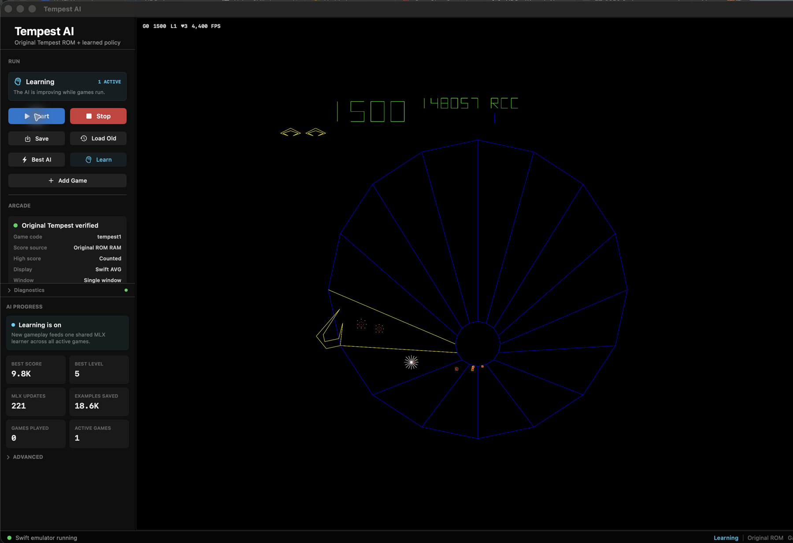
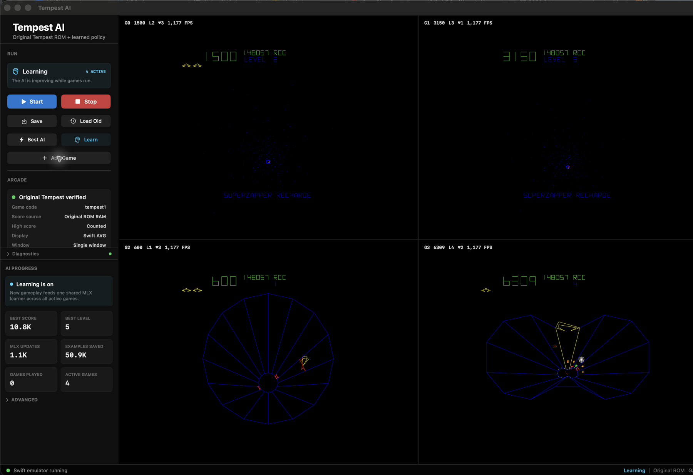

# Tempest AI

Self-contained macOS Swift/Metal/MLX Tempest AI app.



## Demo

The app runs the original `tempest1` ROM inside the macOS window with the Swift
emulator, Swift AVG vector renderer, and MLX/Metal AI runtime. No MAME window,
Python backend, Lua bridge, sockets, ScreenCaptureKit, or external game process
is used by the normal app runtime.

<video src="docs/media/tempest-ai-demo.mp4" controls width="100%"></video>

[Watch the short MP4 demo](docs/media/tempest-ai-demo.mp4)



## Current Runtime

The current app lives in `TempestAI/` and runs without external game processes:

- Original `tempest1` ROM bytes from `roms/tempest1/`
- Swift 6502 and Atari Tempest hardware emulation
- Swift AVG vector output rendered by Metal
- MLX/Metal Rainbow-style AI inference and learning
- App data, learned state, and high-score persistence under
  `~/Library/Application Support/TempestAI/`

The normal app runtime does not bundle or launch Python, MAME, Lua, sockets, or
ScreenCaptureKit.

## Build And Run

```sh
./build_app.sh
open "build/Tempest AI.app"
```

The current app bundle is created at `build/Tempest AI.app`.

## Active Project Layout

```text
TempestAI/                  Swift app, emulator, Metal renderer, MLX learner
docs/media/                 README screenshots and demo video
models/swift_tensors/       Swift-readable neural tensor package
roms/tempest1/              Original Tempest ROM set used by the Swift emulator
tests/                      Current Swift-runtime and cleanup regression tests
build_app.sh                Release build and app-bundle script
```

## Verification

Run the current static/runtime checks:

```sh
python3 -m pytest -q
swift build -c release --package-path .
./build_app.sh
```

## Credits

Thanks to Dave Plummer and the original `davepl/ArcadeAI` project for the
Tempest AI research foundation, original Python/Lua/MAME training system, and
reference implementation that made this Swift/Metal evolution possible.
